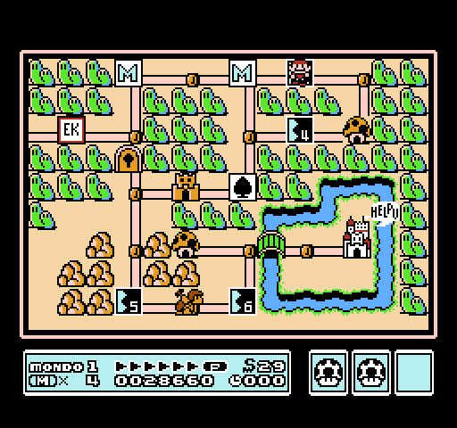

# Super Mario Bros 3

_Legu
[supermariobros3-readme.txt](supermariobros3-readme.txt)
por esperanta priskrbo._

This project is a fan translation of
[Super Mario Bros 3](https://en.wikipedia.org/wiki/Super_Mario_Bros._3),
a video game for the Nintendo Entertainment System, to Esperanto. All
copyrights on the original game belong to Nintendo.

You *must* own a physical copy of the Super Mario Bros 3 cartridge. Downloading
the ROM of any game which you do not own may be considered piracy.

  * Super Mario Bros 3 (USA) (Rev 1) - CRC32 `0B742B33`

Special thanks to captainsouthbird for the
[SMB3 Disassembly](https://github.com/captainsouthbird/smb3)
project.

## Screenshots

Here are some pretty screenshots:

